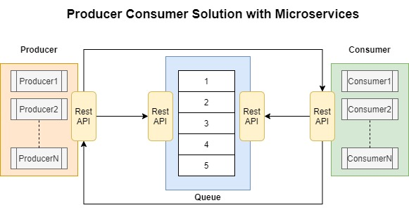

# Producer Consumer Solution

Producer Consumer Problem microservice solution using spring-boot .
## Description

The project has 3 different spring-boot projects (microservices) the producer, the consumer and the queue.
**Queue**
Queue is the microservice that acts as fixed-size buffer. It expose 4 endpoints to the producer and consumer to add, take, check if is full and check if is empty.  

**Producer**
Producer is the microservice that creates and stores the producers processes. Producer is exposing 2 endpoints. One to add a new producer process and one to notify the producers that are idle. A producer process once is created it will start generating Tasks and sending them to the queue service.

**Consumer**
Consumer is the microservice that creates and stores the consumers processes. Consumer is exposing 2 endpoints. One to add a new consumer process and one to notify the consumers that are idle. A consumer process once is created it will start taking Tasks from the queue service and process them.

## Architecture



## Implementation

Call the /producer endpoint exposed by the producer application to create a new producer process that it will start generating tasks on the background until queue is full. Once the queue is full the producer process it will go into Idle state and stop producing tasks. Every time the producer add task to the queue it notifies the consumers to wake up if they are idle and start consuming tasks.

Call the /consumer endpoint exposed by the consumer application to create a new consumer process that it will start taking tasks on the background until queue is empty. Once the queue is empty the consumer process it will go into Idle state and stop consuming tasks. Every time the consumer take a task from the queue it notifies the producers to wake up if they are idle to start producing tasks. 

## Documentation API

**Queue**
Queue API is used by the producer and consumer microservices
```http
GET /queue/is-full
``` 
*Success Response:*
*Code:* 200  
*Content:*  `true`

*Error Response:*
*Code:* 500 INTERNAL SERVER ERROR
*Content:*  
```http
GET /queue/is-empty
``` 
*Success Response:*
*Code:* 200  
*Content:*  `true`

*Error Response:*
*Code:* 500 INTERNAL SERVER ERROR
*Content:*  

```http
POST/queue/task
``` 
_Request Body:_
`{ "id" : "12345", "data" : "theData" }`
_Success Response:_  
_Code:_  201 
_Content:_ 

_Error Response:_  
_Code:_  500 INTERNAL SERVER ERROR  
_Content:_
```http
GET /queue/task
``` 
_Success Response:_  
_Code:_  200  
_Content:_  `{ "id" : "12345", "data" : "theData" }`

_Error Response:_  
_Code:_  500 INTERNAL SERVER ERROR  
_Content:_

**Producer**
Producer API is used by the consumer microservice and the end user.
```http
GET /producer
``` 
*Success Response:*
*Code:* 200  
*Content:* 

*Error Response:*
*Code:* 500 INTERNAL SERVER ERROR
*Content:*  

```http
GET /wake-up
``` 
*Success Response:*
*Code:* 200  
*Content:* 

*Error Response:*
*Code:* 500 INTERNAL SERVER ERROR
*Content:*  

**Consumer**
Consumer API is used by the producer microservice and the end user.
```http
GET /consumer
``` 
*Success Response:*
*Code:* 200  
*Content:* 

*Error Response:*
*Code:* 500 INTERNAL SERVER ERROR
*Content:*  

```http
GET /wake-up
``` 
*Success Response:*
*Code:* 200  
*Content:* 

*Error Response:*
*Code:* 500 INTERNAL SERVER ERROR
*Content:*  

## Getting Started

### Create docker images and run it
For each project do the following steps:
1. Navigate to root directory
2. Generate the jar file with the bellow command
```
mvnw install
```
3. Build images for the 3 projects
```
docker build -t queue-microservice.jar .
docker build -t producer-microservice.jar .
docker build -t consumer-microservice.jar .
```
4. Run docker images for 3 projects
```
docker run -p 8080:8080 queue-microservice.jar
docker run -p 8181:8181 producer-microservice.jar
docker run -p 8282:8282 consumer-microservice.jar
```
## Future Work
1. Make the shared code a shared library to be used by the other services
2. Make one project to add the shared library and the 3 projects as modules
3. Add monitoring metrics